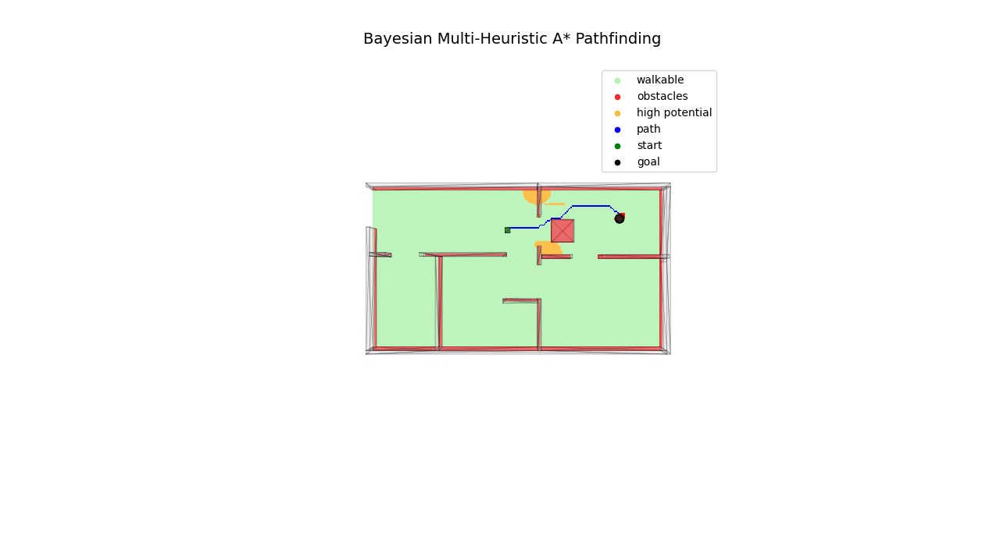
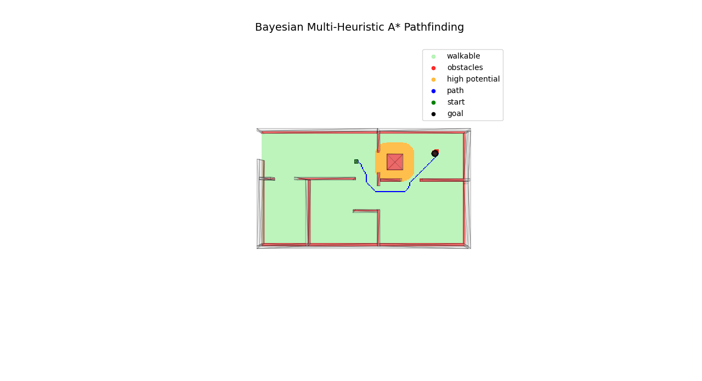

# Bayesian Multi-Heuristic Pathfinding System

This project integrates GPT-based danger assessment and Bayesian reasoning into a pathfinding system using BIM data.

## Features

- **AI Environmental Assessment**: Uses OpenAI GPT to evaluate obstacle danger levels based on real-time environmental context
- **Bayesian Updates**: Applies Bayes' theorem to continuously update obstacle risk assessments
- **Multi-Heuristic A***: Advanced pathfinding algorithm balancing distance optimization with safety considerations
- **BIM Integration**: Direct integration with building models (FBX/STL) for accurate spatial representation
- **3D Visualization**: Comprehensive visualization of paths, obstacles, and potential fields

## Quick Start

1. **Install dependencies**:
```bash
pip install numpy open3d matplotlib requests 
```

2. **Set OpenAI API key** in `main_pipeline.py`:
```python
API_KEY = "your-openai-api-key"
```

3. **Run**:
```python
python main_pipeline.py
```

## How It Works

1. Converts BIM mesh to navigation grid
2. GPT analyzes obstacle danger from environmental context
3. Applies Bayesian reasoning to update risk assessments
4. Computes repulsive potential fields around obstacles
5. Multi-Heuristic A* finds optimal safe path
6. 3D visualization shows results

## File Structure

```
├── images/
│   ├── empty_scenario.png       # Empty office pathfinding result
│   └── busy_scenario.png        # Busy office pathfinding result
├── bim/
│   ├── dicelab_bim.fbx          # Example BIM model
│   └── dicelab_bim.stl          # Converted mesh
├── grid/
│   ├── grid_generator.py        # Navigation grid generation
│   └── node.py                  # Grid node implementation
├── fields/
│   ├── repulsive_field.py       # Static potential fields
│   └── dynamic_repulsion_manager.py  # Dynamic obstacle management
├── pathfinding/
│   └── mhastar.py               # Multi-Heuristic A* algorithm
├── utils/
│   ├── bim_integration.py       # BIM-to-pathfinding bridge
│   ├── bayesian_repulsion_updater.py  # AI environmental assessment
│   ├── extract_fbx_objects.py   # BIM object extraction
│   └── extracted_objects.json   # Structured object data
└── main_pipeline.py             # Complete system pipeline
```

## Example: Context-Aware Pathfinding

**Scenario 1 - Empty Office:**
```
Context: "Workstation is very very empty today, go to destination"
Result: Path goes directly through workstation area (low danger assessment)
```



**Scenario 2 - Busy Office:**  
```
Context: "Workstation is very very busy today, go to destination"
Result: Path avoids workstation area (high danger assessment)
```


The same physical environment produces different optimal paths based on real-time context.

## Requirements

- Python 3.8+
- OpenAI API key
- 3D mesh file (.stl or .fbx)
